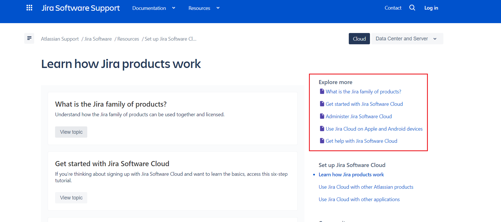
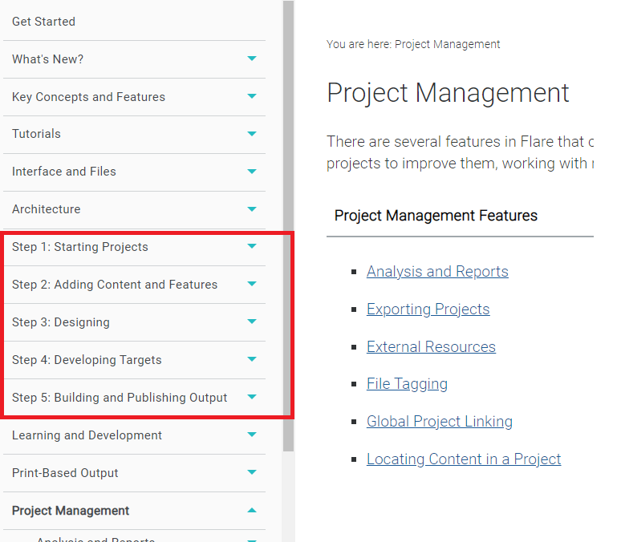

# Pros and cons of Jira/Confluence/Flare documentation
**Table of contents**
<!-- MarkdownTOC -->

- [Pros and cons of Jira/Confluence/Flare documentation](#pros-and-cons-of-jiraconfluenceflare-documentation)
  - [Jira](#jira)
  - [CONFLUENCE](#confluence)
  - [FLARE](#flare)
  

## Jira 
**PROS**

1. What caught my eye was the "community" section, where users can ask questions and exchange tips.

2. Daily bug/problem reports and resolution information. I see this as an open form of communication between administrators and users.

**CONS**

1. When you open the page on the big screen and click on , it displays a list that is very offset from the left edge. In general, the site doesn't adjust very well to a larger resolution.
2. The repetition of the topics on the right hand side as an "Explore more" section is unnecessary, as the same is developed in the main part of the page (see screen below). [-click-](
https://support.atlassian.com/jira-software-cloud/docs/learn-how-jira-products-work/)
   

## CONFLUENCE
**PROS**

1. Instructions in the form of animations/screen recordings (Section: What is Confluence Cloud?).

**CONS**

1. Same observation as in Jira: When you open the page on the big screen and click on the list, it displays a list that is very offset from the left edge. In general, the site doesn't adjust very well to a larger resolution. 
2. It is a shame that the instruction in the form of recordings/animations cannot be stopped. When you watch it, you don't know when the recording begins and when it ends. 

## FLARE
**PROS**

1. The home page informs about the latest features in the software. For a new user it is not important, so it is at the bottom of the page, but for an experienced user it will still be visible.
2. New features are presented as a video.
3. On the home page, the search engine is immediately striking. When moving to the next sections it is also visible and remains on the top bar even when scrolling the page.
4. The screenshots with descriptions are well done. It's good that they are small and can be enlarged by clicking, not just hovering (that would make it difficult to view on a computer in my opinion). I also like the fact that they only show things that are relevant at the time, not the whole screen.

**CONS**
1. In the highlighted section, I am missing the distinction of what the steps are about.
   
2. [On the home page](https://help.madcapsoftware.com/flare2021r3/Content/Flare/Introduction/Home.htm) the "watch the video" caption is clickable, but the banner underneath is not.
3. It is a little bit confusing that the bottom bar with company data, support and troubleshooting is not visible all the time. It is visible only on the main page, and after navigating further it is not there anymore.
   